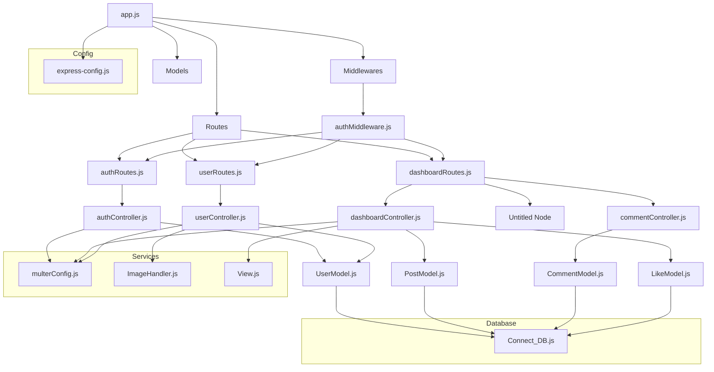

# 🏡 우당탕탕 커뮤니티

우당탕탕 커뮤니티는 사용자들이 자유롭게 소통하고 의견을 공유할 수 있는 **커뮤니티 서비스**입니다.

## 🚀 프로젝트 개요
### 📌 깃허브 레포지토리
- **프론트엔드:** [🔗 링크](https://github.com/100-hours-a-week/2-semi-hyun-community-fe)
- **백엔드:** [🔗 링크](https://github.com/100-hours-a-week/2-semi-hyun-community-be)

### 🛠️ 기술 스택
- **프론트엔드:** HTML, CSS, JavaScript
- **백엔드:** Express.js, Node.js
- **데이터베이스:** MySQL


## 🔥 주요 기능
### 🏠 회원 시스템
- **회원가입 및 로그인:** 사용자는 계정을 생성하고 로그인하여 커뮤니티에 참여할 수 있습니다.
- **닉네임 설정:** 자신만의 개성 있는 닉네임을 설정할 수 있습니다.

### 📝 게시판 기능
- **게시글 관리:** 사용자 별로 게시글을 작성, 수정, 삭제할 수 있습니다.
- **댓글 시스템:** 게시글에 댓글을 남겨 상호작용할 수 있습니다.
- **좋아요 기능:** 게시글에 공감할 수 있도록 좋아요를 누를 수 있습니다.

### 🔒 보안
- **세션/쿠키 기반 인증** 서버에 사용자 정보를 저장하고, 쿠키를 통해 인증 정보를 전달합니다.

### 📖 실행방법
``` bash
# 의존성 설치
npm install

# .env 파일 생성 
# env.example 복사 후 db 정보 수정
cp .env.example .env

# app.js 실행
node app.js
  
##  📁 폴더구조 (back-end)
```
2-semi-hyun-community-be
├─ app.js
├─ package-lock.json
├─ package.json
├─ .gitignore
├─ README.md
└─ server
   ├─ config
   │  ├─ express-config.js
   │  └─ .env.example
   ├─ Controllers
   │  ├─ authController.js
   │  ├─ commentController.js
   │  ├─ dashboardController.js
   │  └─ userController.js
   ├─ data
   │  ├─ images
   │  │  └─ profile
   ├─ Middlewares
   │  ├─ authMiddleware.js
   │  └─ loggingMiddleware.js
   ├─ Models
   │  ├─ CommentModel.js
   │  ├─ Connect_DB.js
   │  ├─ LikeModel.js
   │  ├─ PostModel.js
   │  └─ UserModel.js
   ├─ Routes
   │  ├─ authRoutes.js
   │  ├─ dashboardRoutes.js
   │  └─ userRoutes.js
   └─ Service
      ├─ ImageHandler.js
      ├─ multerConfig.js
      └─ View.js

```

## 📂 파일 구조



## 📌 향후 개선 사항
- **알림 시스템 추가** (댓글 및 좋아요 반응 알림 제공)
- **싫어요 기능 추가** (게시글 좋아요/싫어요 기능 사용)
- **관리자 페이지 도입** (게시글 관리 및 사용자 제어 기능)
