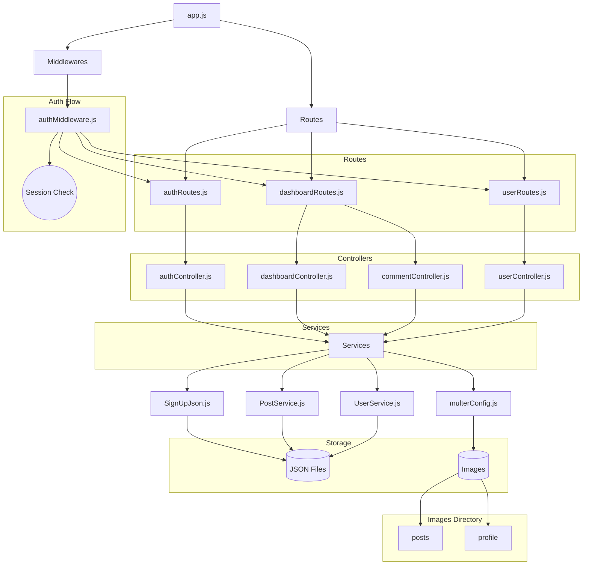

# 2-semi-hyun-community-be
## 🍀1. 정리
- [2-semi-hyun-community-fe](https://github.com/100-hours-a-week/2-semi-hyun-community-fe)
- [2-semi-hyun-community-be](https://github.com/100-hours-a-week/2-semi-hyun-community-be)

## 🍀2. 스택
Node.js, JavaScript

## 🍀3. 기능
- 사용자 별 게시글 작성/수정/삭제 기능 구현
- 게시글 댓글 기능을 통해 상호작용 가능
- 나만의 닉네임을 가져봐요★
  
## 🍀4. 폴더구조
```
2-semi-hyun-community-be
├─ .gitignore
├─ .vscode
│  ├─ launch.json
│  └─ settings.json
├─ app.js
├─ package-lock.json
├─ package.json
├─ README.md
└─ server
   ├─ Controllers
   │  ├─ authController.js
   │  ├─ commentController.js
   │  ├─ dashboardController.js
   │  └─ userController.js
   ├─ data
   │  ├─ images
   │  └─ json
   │     ├─ login.json
   │     └─ posts.json
   ├─ Middlewares
   │  └─ authMiddleware.js
   ├─ Models
   ├─ Routes
   │  ├─ authRoutes.js
   │  ├─ dashboardRoutes.js
   │  └─ userRoutes.js
   └─ Service
      ├─ multerConfig.js
      ├─ PostService.js
      ├─ SignUpJson.js
      ├─ TimeStamp.js
      └─ UserService.js

```

## 🍀5. 파일구조

